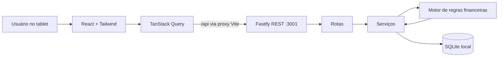
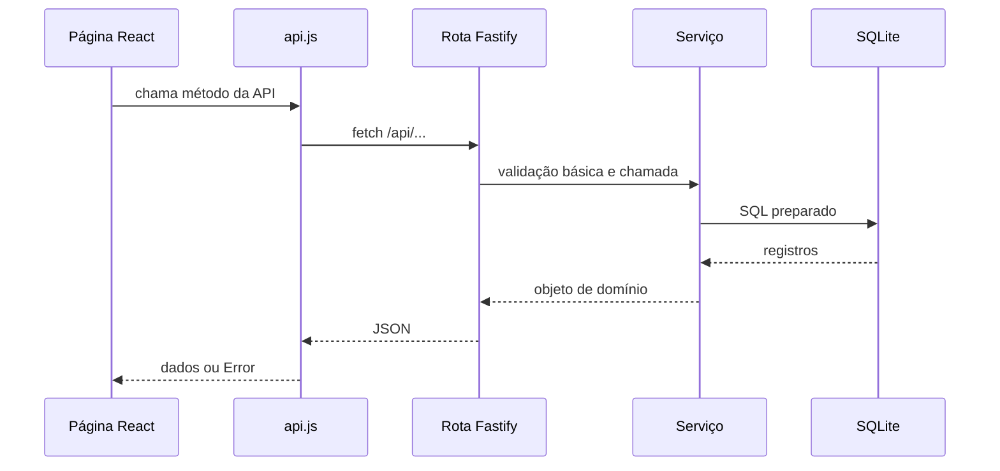

# Visão geral e arquitetura original

> Documento histórico da versão cliente/servidor. A arquitetura vigente é o APK offline-first descrito em [08-decisao-apk-offline.md](./08-decisao-apk-offline.md).

## Objetivo do produto

O Dynamic Pilates é um sistema operacional para o dia a dia de um estúdio de Pilates e fisioterapia. A interface foi desenhada para tablet, com botões grandes, modais simples e tarefas frequentes realizadas com poucos toques.

Os usuários pretendidos são profissionais ou administradores do estúdio. O código atual não possui autenticação nem perfis de acesso.

## Capacidades implementadas

### Dashboard

- valores recebidos no mês;
- valor e quantidade de cobranças vencidas;
- número de alunos ativos;
- total de alunos, presenças e faltas do dia;
- chamada rápida por horário;
- alertas de vencimento;
- baixa rápida de pagamento;
- atalho de cobrança via WhatsApp.

### Alunos

- busca por nome;
- filtro por situação financeira;
- visualização do contrato e da fidelidade;
- criação de aluno, contrato, horários e primeira cobrança;
- alteração de dados contratuais;
- remarcação de horários;
- histórico mensal financeiro e de frequência.

### Presença

- seleção de data;
- agrupamento dos alunos pelo horário cadastrado;
- registro idempotente de presença ou falta;
- resumo diário;
- atualização otimista na interface.

### Financeiro

- listagem de cobranças abertas;
- cálculo dinâmico da situação da cobrança;
- baixa de pagamento;
- criação automática da próxima mensalidade;
- resumo financeiro;
- histórico recente de recebimentos.

## Stack efetivamente usada

| Camada | Tecnologia |
|---|---|
| Linguagem | JavaScript ESM |
| Frontend | React 18 |
| Dados remotos no frontend | TanStack Query 5 |
| Build/desenvolvimento | Vite |
| Estilos | Tailwind CSS 3, PostCSS e CSS próprio |
| Ícones | Lucide React |
| Backend | Fastify |
| Banco | SQLite pela API nativa `node:sqlite` (`DatabaseSync`) |
| Segurança HTTP | `@fastify/helmet` |
| CORS | `@fastify/cors` |
| Testes | `node:assert`, sem test runner |

> O README original cita React Router, mas não há React Router instalado ou usado. A navegação é controlada pelo estado `activeTab` em `App.jsx`.

## Arquitetura lógica



### Fluxo de uma requisição



## Organização dos diretórios

```text
Dynamic Pylates/
├── client/
│   ├── public/                 # logo exposta pelo Vite
│   ├── src/
│   │   ├── components/         # navegação, badges, botões e modais
│   │   ├── pages/              # Início, Presença, Alunos e Financeiro
│   │   ├── services/api.js     # cliente HTTP centralizado
│   │   ├── App.jsx             # composição, navegação e QueryClient
│   │   ├── index.css           # Tailwind e estilos globais
│   │   └── main.jsx            # bootstrap React
│   ├── vite.config.js
│   └── package.json
├── server/
│   ├── data/                   # banco SQLite e possíveis arquivos WAL/SHM
│   ├── src/
│   │   ├── config/env.js       # porta, host e caminho do banco
│   │   ├── db/                 # DDL e seed
│   │   ├── routes/             # endpoints Fastify
│   │   ├── rules/              # regras financeiras e contratuais
│   │   ├── services/           # consultas e operações de domínio
│   │   └── server.js           # entrada do backend
│   ├── test/api.test.js
│   └── package.json
├── docs/                       # esta documentação
├── package.json                # atalhos para client e server
└── README.md
```

## Componentes do backend

### `server.js`

Cria a instância Fastify, registra CORS e Helmet, inicializa o banco, executa o seed se não houver alunos, registra as rotas e escuta no host/porta configurados.

### Rotas

As rotas convertem HTTP para chamadas aos serviços. A validação é manual e parcial; não existem schemas Fastify para corpo, parâmetros ou respostas.

### Serviços

Contêm SQL e regras de orquestração. Todas as operações usam uma conexão SQLite síncrona compartilhada.

### Motor de cobrança

`billingEngine.js` centraliza planos, datas de fidelidade, próxima data de vencimento e situação financeira.

### Persistência

`db.js` cria as tabelas automaticamente com `CREATE TABLE IF NOT EXISTS`. O banco padrão fica em `server/data/dynamic_pilates.db`.

## Componentes do frontend

`App.jsx` mantém a aba ativa e configura o cache do TanStack Query com `staleTime` de 10 segundos e uma tentativa adicional em falhas. Não há roteamento por URL; recarregar a página volta à aba inicial.

O Vite atende o frontend na porta 3000 e redireciona `/api` para `http://localhost:3001`. Em produção, essa estratégia precisa ser substituída por configuração de proxy/reverse proxy ou uma URL de API.
